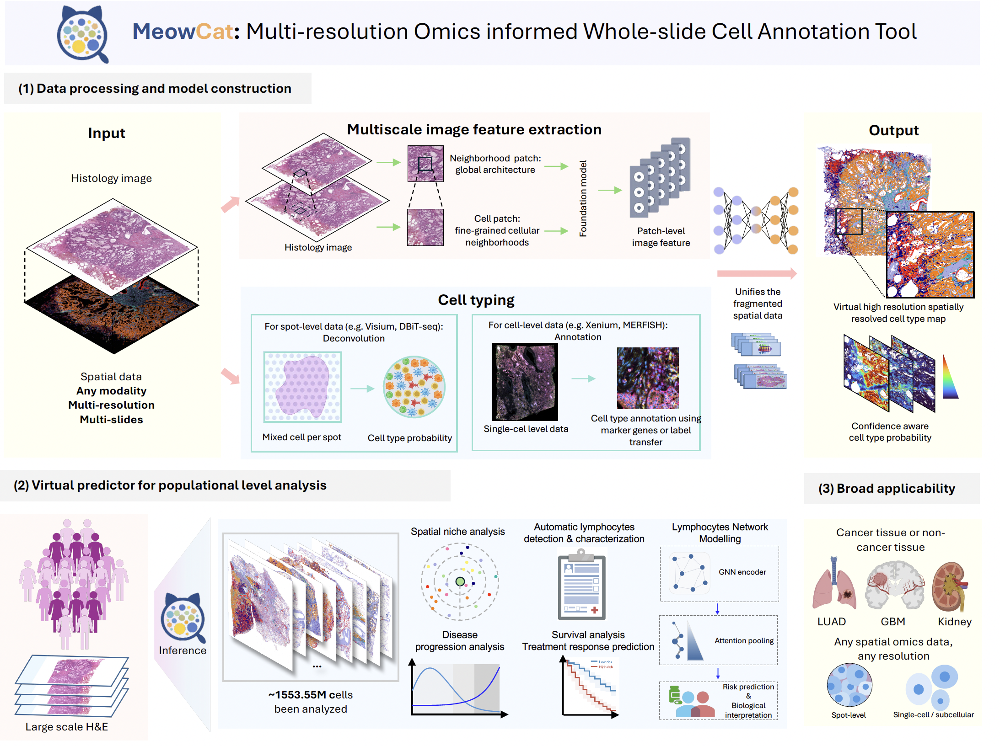

Welcome to the MeowCat documentation!
======================================

MeowCat (**M**\ ulti-resolution **O**\ mics informed **W**\ hole-slide
**C**\ ell **A**\ nnotation **T**\ ool) is a deep learning framework for
cell-type annotation in H&E histopathology images, supervised by spatially
registered transcriptomics data.

|

.. toctree::
   :maxdepth: 2
   :caption: Contents:

   install
   pipeline
   config
   examples
   cli
   api

Citation
========

If you use MeowCat in your research, please cite our paper (preprint forthcoming).
